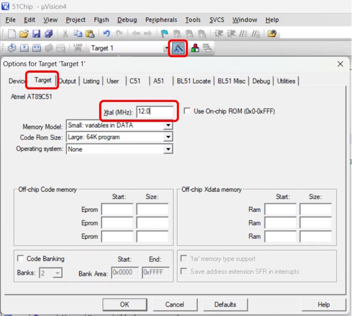
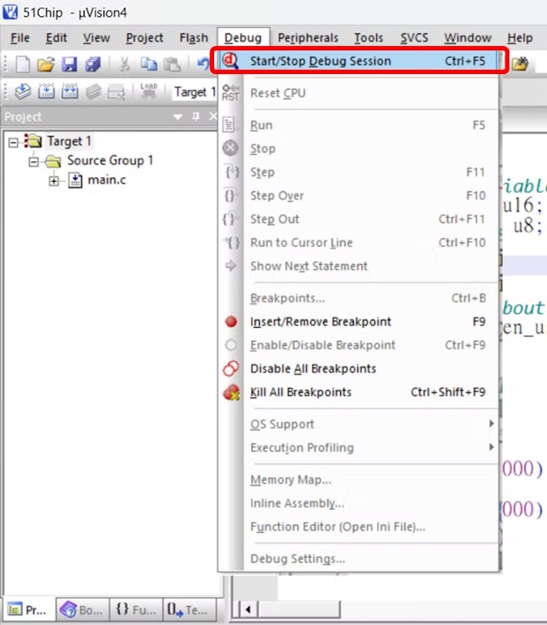
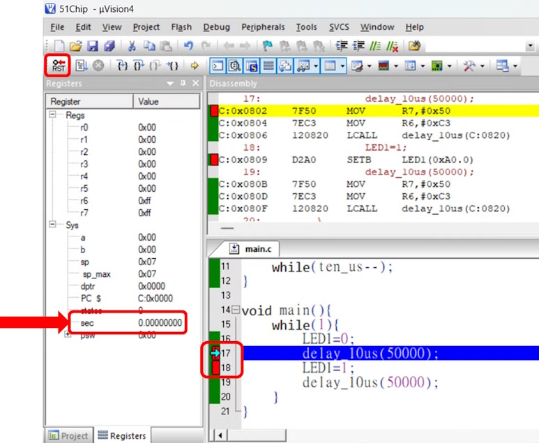
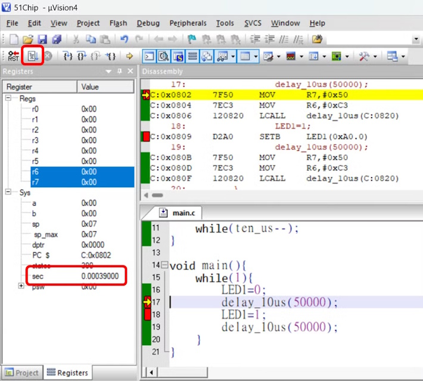
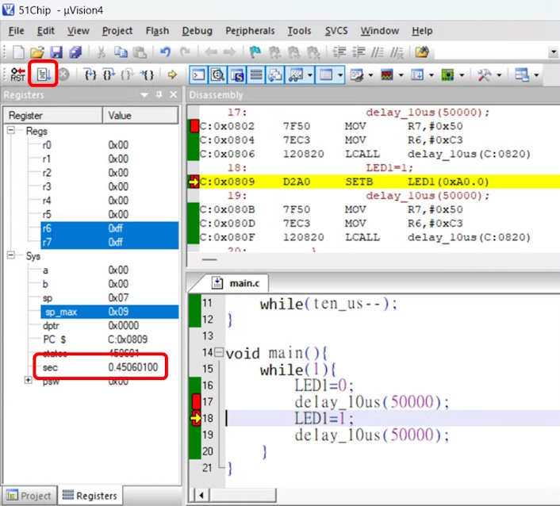

# Program Function
Make LED to blinking, on-off about 1 second  
## Code
```
#include "reg52.h"

//redifene system variable name
typedef unsigned int u16;
typedef unsigned char u8;

sbit LED1=P2^0;

//ten_us = 1, delay about 10us, depend on Cystal
void delay_10us(u16 ten_us){
    while(ten_us--);
}

void main(){
    while(1){
        LED1=0; //Light On
        delay_10us(50000); // Delay about 450ms
        LED1=1; //Light Off
        delay_10us(50000);
    }
}
```
### Variable redefine
```
//redefine system variable name
typedef unsigned int u16;
typedef unsigned char u8;
```
Redefine unsigned char as u8, unsigned int as u16, make code more simplfy and easier to code  
### Delay Function
```
//ten_us = 1, delay about 10us, depend on Cystal
void delay_10us(u16 ten_us){
    while(ten_us--);
}

delay_10us(50000); // Delay about 450ms
```
Simply use MCU clock to make delay, this function cannot be very percise, for percise time delay require timer function  
## Keil simualtor
In the delay function, how to know that delay_10us(50000); is around 450ms  
This will need to use simualtor of Keil to simulate  
### 1. Setup Xtal Frequency
  In **Target Option**, Page **Target**, Xtal(Mhz) must be the crystal oscillator connected to, to simulate correct time  
    
  
### 2. Enter Debug Session
  Quick Key "Ctrl + F5"  
  
  
### 3. Simulate  
  Click on **RST**, at this moment **sec** is 0, on right code double click on target line to make break point  
  Break point can cancel by double click on it again  
    

  Click on **Run**(F5), the program will pause on Line17, at this moment, time passed sec=0.00039s  
    

  Click on **Run**(F5) again, the program will pause on Line18, at this moment, time passed sec=0.450601s  
    
  
