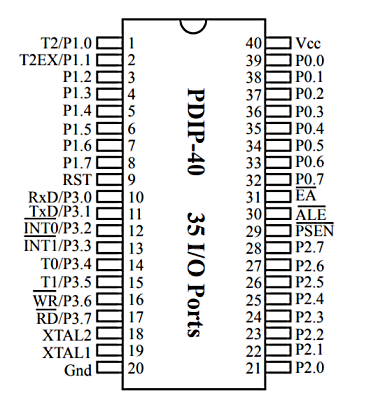

# Basic of 8051 IC  
      
  

* XTAL1, XTAL2 for crystal oscillator, must connected  
* RST for reset, active when HIGH  
* Vcc, Gnd for Power supply  
* EA, ALE, PSEN for external memory, rearly use  
* For 40-DIP type, have 4set of GPIO (P0 ~ P4), total of 4*8(P0.0~P0.7)=32 GPIO  
   - P3 prot, each pin have 2nd function, will introduce latter  

## GPIO Introduce
### P0 Port
Port that without pull-up resistor (open-drain), when output HIHG require a extern pull-up resistor
### P1 ~ P4
Port that with pull-up resistor, can output HIGH normally

# 1st try to Program MCU
### Light up LED
which means to control GPIO to output HIGH or LOW
