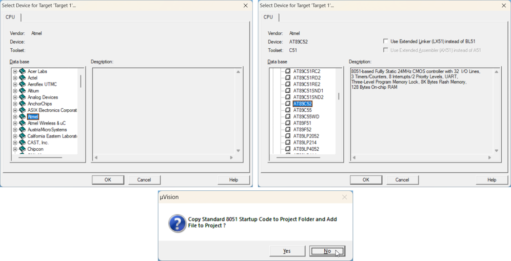
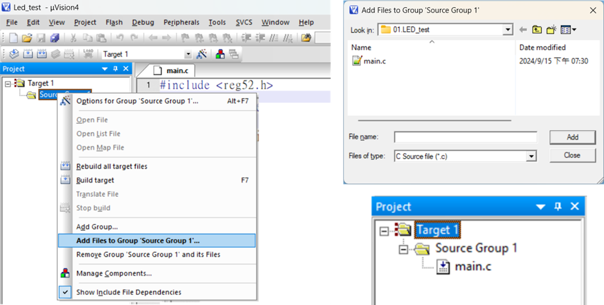
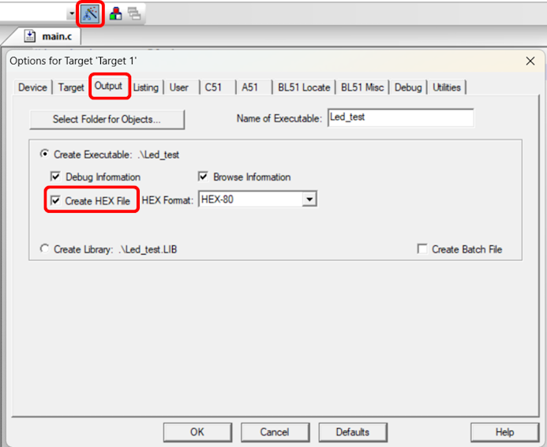
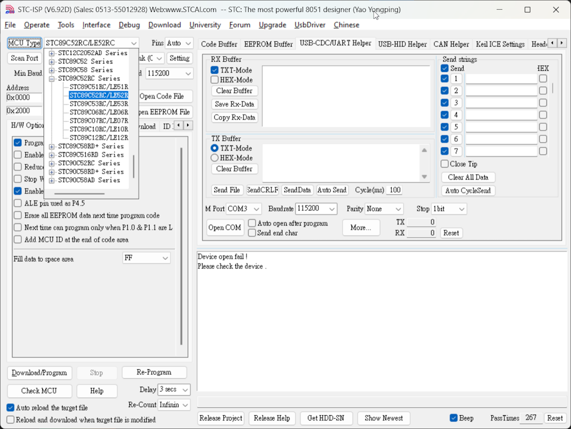
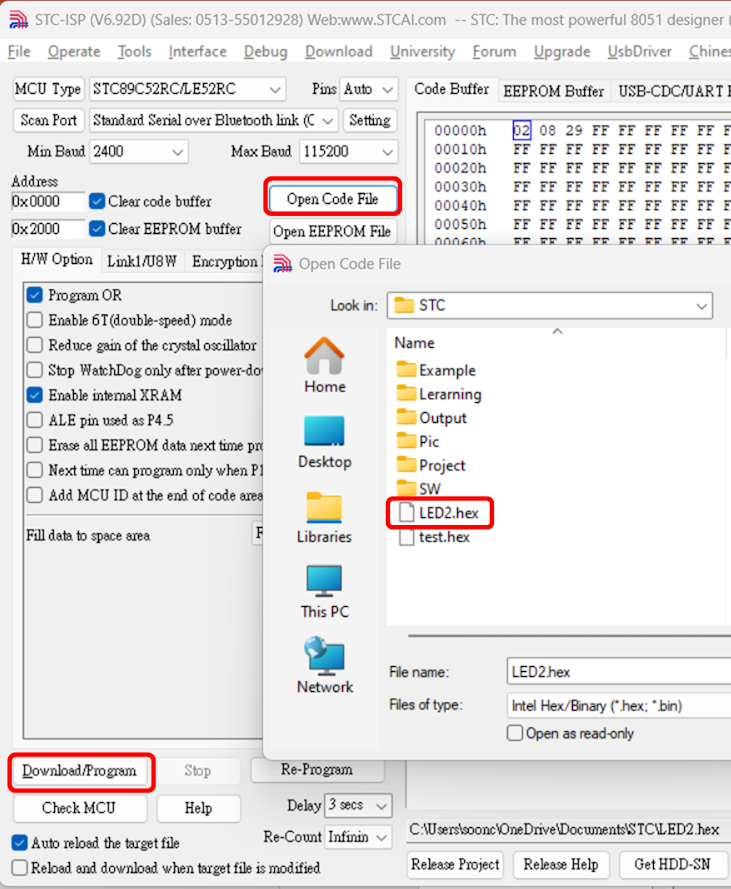

# Start New Project on Keil C51

Start new project in Keil C51  
Project → New uVersion Project → **New Project name**  
    
    
Core of 51IC is relatively similiar, can chose and 89C52 chip, select Atml as example
  
**DO NOT** need to add standard start up code for 8051  
    
  
  
## ADD Add File to Project
Every project require one and only one **"main.c"** code  
Create it and right click on **Source Group 1** to **"Add File to..."**

    

## Setup for Create Hex file
  
Create hex for burning, Keil default do not create it, need to change setting
  
    

# Hex Download to MCU
## Select Corresponding MCU type  

MCU need to be exact same, 89C series can not use Check MCU, but can click on MCU Type to search  
    

## Select Hex and Download to MCU
Open target hex file, and Download to MCU  

> [!IMPORTANT]
> MCU requires power ON-OFF to download program  
  
    
